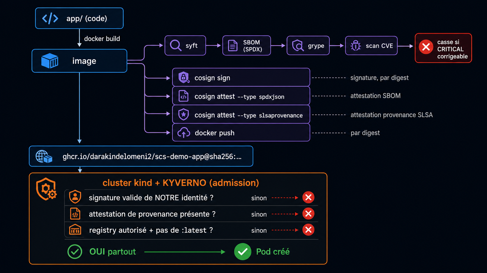
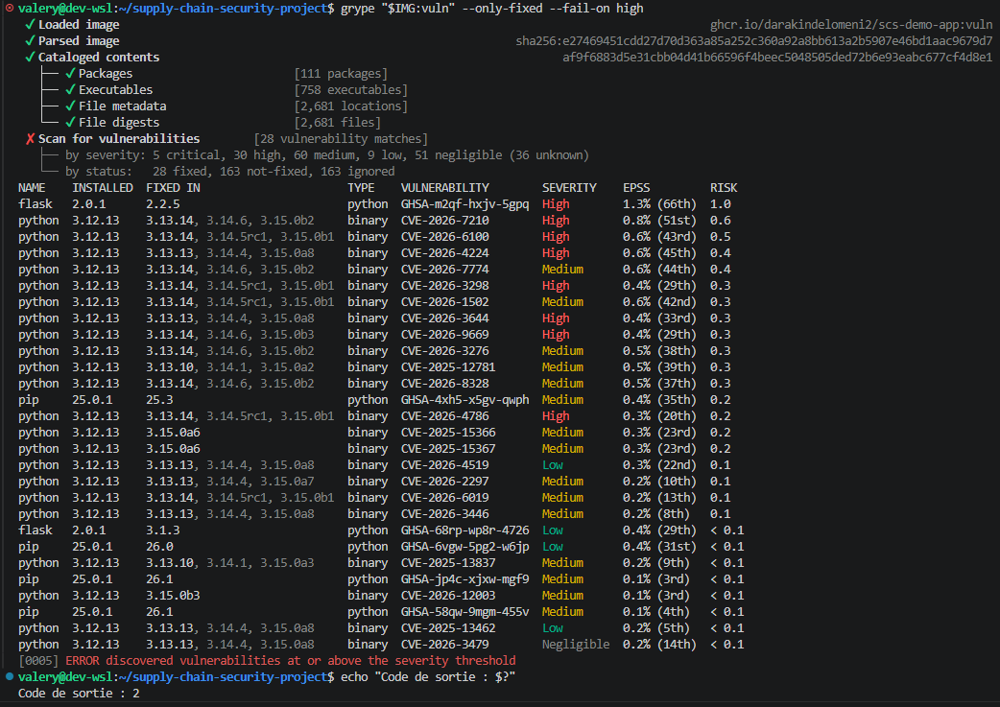
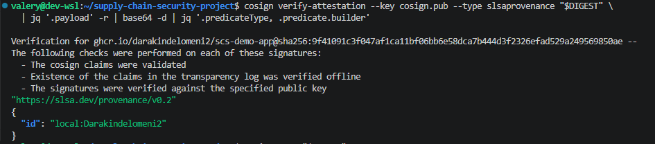
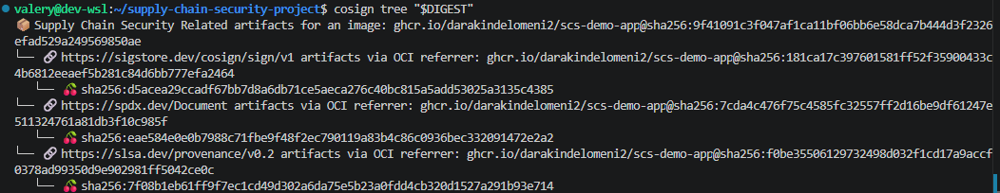
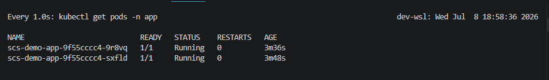

# Rapport — Chaîne d'approvisionnement logicielle sécurisée

- **Groupe : 5** - Ella MZOUGHI · Valéry-Alexandre CAMUS
- **Fork :** <https://github.com/Darakindelomeni2/supply-chain-security-project>
- **Voie :** ☑ Local (kind/k3s) ☐ Azure (AKS/ACR)
- **Date :** 08/07/2026

## 1. Contexte & objectif

Un pipeline CI/CD classique sait *construire, tester et déployer* une image. Mais rien, dans ce
schéma, ne garantit que l'image qui **tourne en production** est **exactement** celle issue du code
que nous avons revu, sans altération entre le build et le déploiement. Un `docker pull` ne vérifie
ni l'origine ni l'intégrité de l'artefact ; « le scan était vert » ne prouve pas que l'image
*déployée* est celle qui a été scannée.

Le risque que nous adressons n'est pas une faille de l'application, mais la **compromission de la
chaîne d'approvisionnement** elle-même : dépendances, build, registry, déploiement. Deux attaques
réelles l'illustrent :

- **SolarWinds (2020)** : du code malveillant injecté dans le *processus de build*, puis **signé
  légitimement** par l'éditeur et distribué à ~18 000 clients. La signature seule ne suffit pas si
  le build est compromis.
- **XZ Utils / liblzma (2024)** : une **backdoor** introduite sur ~3 ans dans une dépendance open
  source de confiance, invisible sans inventaire (SBOM) des composants.

**Objectif du POC.** Transformer le pipeline de l'application fournie en **chaîne d'approvisionnement
vérifiable** : générer un SBOM, scanner les vulnérabilités, **signer** l'image et y attacher des
**attestations** (SBOM + provenance SLSA), puis déployer sur un cluster Kubernetes dont le contrôle
d'admission (**Kyverno**) **refuse activement** toute image qu'il ne peut pas prouver digne de
confiance. Cible de maturité visée : **SLSA niveau 2**.

## 2. Architecture de la chaîne



| Outil | Rôle dans la chaîne |
| --- | --- |
| **Docker** | construire l'image (multi-stage, non-root uid 10001) |
| **Syft** | générer le SBOM (liste des composants) |
| **Grype** | scanner le SBOM → gate sur CVE critique |
| **cosign** (Sigstore) | signer l'image + attacher attestations (SBOM, provenance) |
| **GHCR** | registry — stocke image + signatures/attestations (OCI) |
| **Kyverno** | admission control — vérifie et **bloque** dans le cluster |

## 3. Mise en œuvre

L'image est construite via un Dockerfile **multi-stage** (étape `builder` isolée, image `runtime`
minimale) et exécutée en **utilisateur non-root** (`appuser`, uid 10001) — durcissement dès le build.
Elle est poussée sur GHCR puis référencée **par digest** pour toute la suite :

```text
ghcr.io/darakindelomeni2/scs-demo-app@sha256:691565737b2dc1bf1d3eecce28a04d8cdc6e467c0092aeeb74fade1cef95c719
```

### 3.1 SBOM (Syft)

SBOM généré au format **SPDX** (standard interopérable ; CycloneDX également disponible via
`-o cyclonedx-json`). C'est l'inventaire exhaustif des composants de l'image.

```bash
syft "$IMG:$TAG" -o spdx-json > sbom.spdx.json
```

- **113 paquets** catalogués, fichier SPDX de **2,3 Mo**.
- Composition : Python 3.12.13, Flask 3.0.3, gunicorn 22.0.0, + paquets système Debian
  (`apt`, `libc6`, `perl-base`…).
- Le SBOM est un **artefact régénérable** → volontairement **non versionné** (`.gitignore`).

### 3.2 Scan de vulnérabilités (Grype)

Politique de gate — `.grype.yaml` : ne casse la chaîne que sur une CVE **CRITICAL corrigeable**
(`only-fixed: true` élimine le bruit non-actionnable).

```yaml
only-fixed: true
fail-on-severity: critical
```

**Image saine — la gate passe (code 0).** Sur 190 vulnérabilités brutes (5 critical, 29 high…),
le filtre `only-fixed` n'en retient que **27 corrigeables**, dont **aucune critique** → la gate
laisse passer, à raison.

```bash
grype "$IMG:$TAG" ; echo "Code de sortie : $?"   # → 0
```

Les **5 CVE critiques** existent mais sont **non-corrigeables** (risque résiduel, cf. §5) :

```text
libc-bin   CVE-2026-5450    fix=wont-fix
libc6      CVE-2026-5450    fix=wont-fix
perl-base  CVE-2026-42496   fix=wont-fix
perl-base  CVE-2026-8376    fix=wont-fix
perl-base  CVE-2026-12087   fix=not-fixed
```

**Démonstration — la gate casse.** En rétrogradant volontairement Flask (`2.0.1`, CVE corrigeable
`GHSA-m2qf-hxjv-5gpq`, High, corrigée en 2.2.5) et en abaissant le seuil à `high` pour illustrer le
mécanisme, Grype sort en **code ≠ 0 (2)** et stoppe la chaîne :

```bash
grype "$IMG:vuln" --only-fixed --fail-on high ; echo "Code de sortie : $?"
# ✘ ERROR discovered vulnerabilities at or above the severity threshold
# Code de sortie : 2
```



> Note : la gate de **production** reste sur `critical` (`.grype.yaml`) ; l'abaissement à `high`
> ci-dessus sert uniquement à démontrer le blocage. L'image vulnérable n'a été ni signée ni poussée.

**Contre-vérification Grype vs Trivy (bonus).** La même image saine scannée par les deux outils
donne des comptes **différents** — bases de vulnérabilités distinctes (Anchore vs Aqua) :

| | Grype | Trivy |
| --- | --- | --- |
| Total | 190 | 169 |
| Critical | 5 | 2 |
| High | 29 | 18 |

Grype et Trivy remplissent le **même rôle** (scanner + casser un job CI sur seuil) : ce sont deux
outils interchangeables pour le maillon « scan », pas deux contrôles différents. Seule la syntaxe de
la gate change — `grype --fail-on critical` (+ `only-fixed`) vs
`trivy image --exit-code 1 --severity CRITICAL --ignore-unfixed`. **Les deux gates concluent
identiquement** que l'image saine n'a **aucune critique corrigeable** et passent (exit 0). Notre
chaîne « officielle » utilise **Grype** (cf. workflow CI de référence) ; Trivy sert de
contre-vérification. Enseignement : le choix du scanner influe sur ce que l'on voit — aucun n'est
exhaustif, ils sont complémentaires.

### 3.3 Signature (cosign)

Signature **par clé** (`cosign generate-key-pair` → `cosign.key` gardé secret et **gitignoré**,
`cosign.pub` publiée). L'image est signée **par digest** (jamais par tag). Le mode **keyless**
(identité OIDC) est réservé à la CI (Lab 5).

```bash
cosign sign   --key cosign.key "$DIGEST"
cosign verify --key cosign.pub "$DIGEST"
```

```text
Verification for ghcr.io/darakindelomeni2/scs-demo-app@sha256:9f41... --
  - The cosign claims were validated
  - Existence of the claims in the transparency log was verified offline
  - The signatures were verified against the specified public key
```

La 2ᵉ ligne confirme que cosign a aussi **journalisé la signature dans Rekor** (log de transparence
public) — traçabilité et non-répudiation, en plus de la vérification par clé publique.



### 3.4 Attestations (SBOM + provenance)

Deux attestations **signées** sont rattachées au même digest : le SBOM et une provenance SLSA.

```bash
# SBOM
cosign attest --key cosign.key --predicate sbom.spdx.json --type spdxjson "$DIGEST"
cosign verify-attestation --key cosign.pub --type spdxjson "$DIGEST" \
  | jq -r '.payload' | base64 -d | jq '.predicateType'
# → "https://spdx.dev/Document"

# Provenance SLSA (prédicat local : buildType, builder, commit git)
cosign attest --key cosign.key --predicate provenance.json --type slsaprovenance "$DIGEST"
cosign verify-attestation --key cosign.pub --type slsaprovenance "$DIGEST" \
  | jq -r '.payload' | base64 -d | jq '.predicateType, .predicate.builder'
# → "https://slsa.dev/provenance/v0.2"  +  { "id": "local:Darakindelomeni2" }
```

`cosign tree` confirme que signature et attestations vivent comme **artefacts OCI** à côté de
l'image, indexés par le digest :

```text
📦 ...scs-demo-app@sha256:9f41...
├── 🔗 sigstore.dev/cosign/sign/v1   (signature)
├── 🔗 spdx.dev/Document             (attestation SBOM)
└── 🔗 slsa.dev/provenance/v0.2      (attestation provenance)
```



> Limite assumée (cf. §5) : cette provenance est un **prédicat fabriqué localement** → elle atteste
> l'origine (**SLSA L1**), sans prouver l'isolation du build. La provenance **L2** authentique est
> produite en CI par l'identité OIDC du workflow (Lab 5).

### 3.5 Admission (Kyverno)

Cluster **kind** (1 control-plane + 1 worker) avec **Kyverno v1.18.1** installé comme *admission
webhook*. Quatre `ClusterPolicy` en **`validationFailureAction: Enforce`** (bloquant, pas `Audit`) :

| Policy | Type | Contrôle |
| --- | --- | --- |
| `allowed-registries` | `validate` | image uniquement depuis `ghcr.io/darakindelomeni2/*` |
| `disallow-latest-tag` | `validate` | refuse `:latest` / absence de tag |
| `verify-image-signature` | `verifyImages` | signature cosign valide de **notre** clé + `mutateDigest` |
| `require-provenance-attestation` | `verifyImages` | attestation de provenance SLSA présente et valide |

**Registry privé (choix DevSecOps assumé).** Le package GHCR reste **privé** ; l'authentification
se fait par `imagePullSecret` (namespace `app`, pour le kubelet) et `imageRegistryCredentials`
(namespace `kyverno`, pour la vérification), avec un PAT dédié **`read:packages`** (moindre privilège).

**Résultat — l'image signée et conforme est ACCEPTÉE :**

```bash
kubectl apply -n app -f k8s/deployment.yaml
# deployment.apps/scs-demo-app created      ← admission Kyverno OK

kubectl get pods -n app
# scs-demo-app-9f55cccc4-9r8vq   1/1   Running
# scs-demo-app-9f55cccc4-sxfld   1/1   Running
```



La bascule `Audit → Enforce` est le passage du « on observe » au « on **bloque** » : ici le cluster
n'exécute que ce qu'il peut **prouver** (signé par nous + provenance), tout le reste est rejeté
(démonstration attaque/défense au §4).

## 4. Démonstration attaque / défense (1 p.)

Tableau des scénarios (non signée, modifiée, registry, latest, sans provenance) + **captures**
du refus Kyverno. Lien vers la capture vidéo.

| Scénario | Résultat | Contrôle déclenché | Preuve |
| --- | --- | --- | --- |
| Image légitime | ✅ acceptée | — | capture |
| Non signée | ❌ refusée | verifyImages | capture |
| Modifiée après signature | ❌ refusée | signature/digest | capture |
| Registry non autorisé | ❌ refusée | allowed-registries | capture |
| `:latest` | ❌ refusée | disallow-latest | capture |

## 5. Positionnement SLSA & limites

**Niveau réellement atteint : SLSA L1** (voie locale). La provenance **existe** et est **signée**,
mais elle est produite **sur notre poste** à partir d'un prédicat rédigé à la main : elle *déclare*
l'origine sans prouver l'isolation du build. Le passage à **L2** (build **hébergé** + provenance
signée par une identité de plateforme) est atteint en **CI GitHub Actions via l'OIDC du workflow**
(Lab 5) — c'est notre cible, pas encore l'état de la voie locale. **L3** (build isolé, provenance
infalsifiable) reste hors périmètre.

**Ce qui reste contournable (honnêteté) :**

- On fait confiance au **poste de build** et à la personne qui signe : un initié légitime (cf. XZ)
  passe tous les contrôles cryptographiques.
- La provenance L1 est **auto-déclarée** : rien n'empêche d'y écrire un commit mensonger et de la
  signer quand même.
- La **clé privée cosign** est un secret local : sa fuite casse toute la chaîne (le keyless CI la
  supprime — bonus Lab 5).
- Le registry public/privé ne protège que la **confidentialité**, pas l'intégrité.

**Limites techniques rencontrées (et traitées) — vécu de terrain :**

1. **cosign v3 ↔ Kyverno v1.18.** cosign v3 stocke signatures et attestations via l'**API OCI 1.1
   referrers** ; or la vérification d'attestation de cosign n'a pas de code path referrers
   (**bug upstream `sigstore/cosign#4708`**), limite héritée par Kyverno → images rejetées à tort.
   Résolu en signant avec **cosign v2.4.1** (schéma *tag-based*). *Cause racine : le prérequis
   installe cosign via `latest` — un tag mutable **non épinglé**, l'anti-pattern même que ce projet
   dénonce. Leçon : on épingle les versions, y compris celles de la toolchain de sécurité.*
2. **Limite de contexte Kyverno.** L'attestation SBOM SPDX niveau-fichier (2,3 Mo) dépassait le
   `maxContextSize` par défaut (2 Mi), non configurable en v1.18 → SBOM **package-level** (213 Ko).
3. **Registry privé.** Authentification à deux endroits (kubelet + Kyverno) via secrets dédiés,
   PAT `read:packages` en moindre privilège.
4. **Durcissement pod.** `runAsNonRoot` exige un **UID numérique** (`runAsUser: 10001`) car le
   Dockerfile utilise un `USER` nommé ; `readOnlyRootFilesystem` impose un volume `emptyDir` sur
   `/tmp` pour gunicorn.

**Pistes vers un niveau supérieur :** provenance authentique via `slsa-github-generator` (L2/L3),
signature **keyless** OIDC vérifiée par identité de workflow épinglée, et **attestation de scan**
vérifiée à l'admission (bloquer aussi sur vulnérabilité, pas seulement sur signature).

## 6. Reproductibilité (½ p.)

Étapes pour tout reconstruire de zéro (`kind create` → politiques → déploiement → démo).

## 7. Bilan (½ p.)

Ce que vous avez appris ; ce que vous feriez différemment ; répartition du travail dans le groupe.

## Annexes

Commandes complètes, liens Rekor (si keyless), sorties brutes.
