# Rapport - Chaîne d'approvisionnement logicielle sécurisée

- **Groupe : 5** - Ella MZOUGHI · Valéry-Alexandre CAMUS
- **Fork :** [https://github.com/Darakindelomeni2/supply-chain-security-project](https://github.com/Darakindelomeni2/supply-chain-security-project)
- **Voie :** ☑ Local (kind/k3s) ☐ Azure (AKS/ACR)
- **Date :** 08/07/2026

## 1. Contexte & objectif

Un pipeline CI/CD classique sait _construire, tester et déployer_ une image. Mais rien, dans ce
schéma, ne garantit que l'image qui **tourne en production** est **exactement** celle issue du code
que nous avons revu, sans altération entre le build et le déploiement. Un `docker pull` ne vérifie
ni l'origine ni l'intégrité de l'artefact ; « le scan était vert » ne prouve pas que l'image
_déployée_ est celle qui a été scannée.

Le risque que nous adressons n'est pas une faille de l'application, mais la **compromission de la
chaîne d'approvisionnement** elle-même : dépendances, build, registry, déploiement. Deux attaques
réelles l'illustrent :

- **SolarWinds (2020)** : du code malveillant injecté dans le _processus de build_, puis **signé
  légitimement** par l'éditeur et distribué à ~18 000 clients. La signature seule ne suffit pas si
  le build est compromis.
- **XZ Utils / liblzma (2024)** : une **backdoor** introduite sur ~3 ans dans une dépendance open
  source de confiance, invisible sans inventaire (SBOM) des composants.

**Objectif du POC.** Transformer le pipeline de l'application fournie en **chaîne d'approvisionnement
vérifiable** : générer un SBOM, scanner les vulnérabilités, **signer** l'image et y attacher des
**attestations** (SBOM + provenance SLSA), puis déployer sur un cluster Kubernetes dont le contrôle
d'admission (**Kyverno**) **refuse activement** toute image qu'il ne peut pas prouver digne de
confiance. Cible de maturité visée : **SLSA niveau 2**.

## 2. Architecture de la chaîne


| Outil                 | Rôle dans la chaîne                                       |
| --------------------- | --------------------------------------------------------- |
| **Docker**            | construire l'image (multi-stage, non-root uid 10001)      |
| **Syft**              | générer le SBOM (liste des composants)                    |
| **Grype**             | scanner le SBOM → gate sur CVE critique                   |
| **cosign** (Sigstore) | signer l'image + attacher attestations (SBOM, provenance) |
| **GHCR**              | registry — stocke image + signatures/attestations (OCI)   |
| **Kyverno**           | admission control — vérifie et**bloque** dans le cluster  |

## 3. Mise en œuvre

L'image est construite via un Dockerfile **multi-stage** (étape `builder` isolée, image `runtime`
minimale) et exécutée en **utilisateur non-root** (`appuser`, uid 10001) — durcissement dès le build.
Elle est poussée sur GHCR puis référencée **par digest** pour toute la suite :

```text
ghcr.io/darakindelomeni2/scs-demo-app@sha256:691565737b2dc1bf1d3eecce28a04d8cdc6e467c0092aeeb74fade1cef95c719
```

### 3.1 SBOM (Syft)

SBOM généré au format **SPDX** (standard interopérable ; CycloneDX également disponible via
`-o cyclonedx-json`). C'est l'inventaire exhaustif des composants de l'image.

```bash
syft "$IMG:$TAG" -o spdx-json > sbom.spdx.json
```

- **113 paquets** catalogués, fichier SPDX de **2,3 Mo**.
- Composition : Python 3.12.13, Flask 3.0.3, gunicorn 22.0.0, + paquets système Debian
  (`apt`, `libc6`, `perl-base`…).
- Le SBOM est un **artefact régénérable** → volontairement **non versionné** (`.gitignore`).

### 3.2 Scan de vulnérabilités (Grype)

Politique de gate — `.grype.yaml` : ne casse la chaîne que sur une CVE **CRITICAL corrigeable**
(`only-fixed: true` élimine le bruit non-actionnable).

```yaml
only-fixed: true
fail-on-severity: critical
```

**Image saine — la gate passe (code 0).** Sur 190 vulnérabilités brutes (5 critical, 29 high…),
le filtre `only-fixed` n'en retient que **27 corrigeables**, dont **aucune critique** → la gate
laisse passer, à raison.

```bash
grype "$IMG:$TAG" ; echo "Code de sortie : $?"   # → 0
```

Les **5 CVE critiques** existent mais sont **non-corrigeables** (risque résiduel, cf. §5) :

```text
libc-bin   CVE-2026-5450    fix=wont-fix
libc6      CVE-2026-5450    fix=wont-fix
perl-base  CVE-2026-42496   fix=wont-fix
perl-base  CVE-2026-8376    fix=wont-fix
perl-base  CVE-2026-12087   fix=not-fixed
```

**Démonstration — la gate casse.** En rétrogradant volontairement Flask (`2.0.1`, CVE corrigeable
`GHSA-m2qf-hxjv-5gpq`, High, corrigée en 2.2.5) et en abaissant le seuil à `high` pour illustrer le
mécanisme, Grype sort en **code ≠ 0 (2)** et stoppe la chaîne :

```bash
grype "$IMG:vuln" --only-fixed --fail-on high ; echo "Code de sortie : $?"
# ✘ ERROR discovered vulnerabilities at or above the severity threshold
# Code de sortie : 2
```


> Note : la gate de **production** reste sur `critical` (`.grype.yaml`) ; l'abaissement à `high`
> ci-dessus sert uniquement à démontrer le blocage. L'image vulnérable n'a été ni signée ni poussée.

**Contre-vérification Grype vs Trivy (bonus).** La même image saine scannée par les deux outils
donne des comptes **différents** — bases de vulnérabilités distinctes (Anchore vs Aqua) :

|          | Grype | Trivy |
| -------- | ----- | ----- |
| Total    | 190   | 169   |
| Critical | 5     | 2     |
| High     | 29    | 18    |

Grype et Trivy remplissent le **même rôle** (scanner + casser un job CI sur seuil) : ce sont deux
outils interchangeables pour le maillon « scan », pas deux contrôles différents. Seule la syntaxe de
la gate change — `grype --fail-on critical` (+ `only-fixed`) vs
`trivy image --exit-code 1 --severity CRITICAL --ignore-unfixed`. **Les deux gates concluent
identiquement** que l'image saine n'a **aucune critique corrigeable** et passent (exit 0). Notre
chaîne « officielle » utilise **Grype** (cf. workflow CI de référence) ; Trivy sert de
contre-vérification. Enseignement : le choix du scanner influe sur ce que l'on voit — aucun n'est
exhaustif, ils sont complémentaires.

### 3.3 Signature (cosign)

Signature **par clé** (`cosign generate-key-pair` → `cosign.key` gardé secret et **gitignoré**,
`cosign.pub` publiée). L'image est signée **par digest** (jamais par tag). Le mode **keyless**
(identité OIDC) est réservé à la CI (Lab 5).

```bash
cosign sign   --key cosign.key "$DIGEST"
cosign verify --key cosign.pub "$DIGEST"
```

```text
Verification for ghcr.io/darakindelomeni2/scs-demo-app@sha256:9f41... --
  - The cosign claims were validated
  - Existence of the claims in the transparency log was verified offline
  - The signatures were verified against the specified public key
```

La 2ᵉ ligne confirme que cosign a aussi **journalisé la signature dans Rekor** (log de transparence
public) — traçabilité et non-répudiation, en plus de la vérification par clé publique.


### 3.4 Attestations (SBOM + provenance)

Deux attestations **signées** sont rattachées au même digest : le SBOM et une provenance SLSA.

```bash
# SBOM
cosign attest --key cosign.key --predicate sbom.spdx.json --type spdxjson "$DIGEST"
cosign verify-attestation --key cosign.pub --type spdxjson "$DIGEST" \
  | jq -r '.payload' | base64 -d | jq '.predicateType'
# → "https://spdx.dev/Document"

# Provenance SLSA (prédicat local : buildType, builder, commit git)
cosign attest --key cosign.key --predicate provenance.json --type slsaprovenance "$DIGEST"
cosign verify-attestation --key cosign.pub --type slsaprovenance "$DIGEST" \
  | jq -r '.payload' | base64 -d | jq '.predicateType, .predicate.builder'
# → "https://slsa.dev/provenance/v0.2"  +  { "id": "local:Darakindelomeni2" }
```

`cosign tree` confirme que signature et attestations vivent comme **artefacts OCI** à côté de
l'image, indexés par le digest :

```text
📦 ...scs-demo-app@sha256:9f41...
├── 🔗 sigstore.dev/cosign/sign/v1   (signature)
├── 🔗 spdx.dev/Document             (attestation SBOM)
└── 🔗 slsa.dev/provenance/v0.2      (attestation provenance)
```


> Limite assumée (cf. §5) : cette provenance est un **prédicat fabriqué localement** → elle atteste
> l'origine (**SLSA L1**), sans prouver l'isolation du build. La provenance **L2** authentique est
> produite en CI par l'identité OIDC du workflow (Lab 5).

### 3.5 Admission (Kyverno)

Cluster **kind** (1 control-plane + 1 worker) avec **Kyverno v1.18.1** installé comme _admission
webhook_. Quatre `ClusterPolicy` en **`validationFailureAction: Enforce`** (bloquant, pas `Audit`) :

| Policy                           | Type           | Contrôle                                                 |
| -------------------------------- | -------------- | -------------------------------------------------------- |
| `allowed-registries`             | `validate`     | image uniquement depuis`ghcr.io/darakindelomeni2/*`      |
| `disallow-latest-tag`            | `validate`     | refuse`:latest` / absence de tag                         |
| `verify-image-signature`         | `verifyImages` | signature cosign valide de**notre** clé + `mutateDigest` |
| `require-provenance-attestation` | `verifyImages` | attestation de provenance SLSA présente et valide        |

```bash
kubectl get clusterpolicy
# NAME                             ADMISSION   BACKGROUND   READY   MESSAGE
# allowed-registries               true        true         True    Ready
# disallow-latest-tag              true        true         True    Ready
# require-provenance-attestation   true        false        True    Ready
# verify-image-signature           true        false        True    Ready
```

La capture ci-dessous illustre la sortie attendue de la commande de vérification des
`ClusterPolicy` déployés dans le cluster.

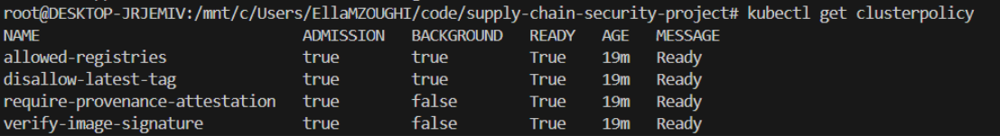 — politiques Kyverno actives" />

**Registry privé (choix DevSecOps assumé).** Le package GHCR reste **privé** ; l'authentification
se fait par `imagePullSecret` (namespace `app`, pour le kubelet) et `imageRegistryCredentials`
(namespace `kyverno`, pour la vérification), avec un PAT dédié **`read:packages`** (moindre privilège).

**Résultat — l'image signée et conforme est ACCEPTÉE :**

```bash
kubectl apply -n app -f k8s/deployment.yaml
# deployment.apps/scs-demo-app created      ← admission Kyverno OK

kubectl get pods -n app
# scs-demo-app-9f55cccc4-9r8vq   1/1   Running
# scs-demo-app-9f55cccc4-sxfld   1/1   Running
```


La bascule `Audit → Enforce` est le passage du « on observe » au « on **bloque** » : ici le cluster
n'exécute que ce qu'il peut **prouver** (signé par nous + provenance), tout le reste est rejeté
(démonstration attaque/défense au §4).

## 4. Démonstration attaque / défense

L’objectif de cette étape était de vérifier, sur un cluster kind, que les politiques d’admission
Kyverno bloquent bien les artefacts non conformes avant leur exécution. Le cas nominal a d’abord
été validé, puis plusieurs scénarios d’attaque ont été soumis au contrôle d’admission.

### 4.1 Image signée et conforme

L’image signée, attestée et déployée par digest a été acceptée par le cluster. La capture ci-dessous montre les pods de l’application en état `Running`, ce qui confirme que
l’assemblage “image signée + provenance + registry autorisé + digest” est bien admis.

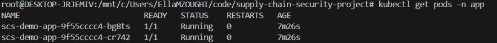

### 4.2 Image non signée

Une image non signée a ensuite été soumise au déploiement. La requête a été refusée à
l’admission par Kyverno. La capture ci-dessous montre l’échec du contrôle de signature, attestant que l’intégrité
cryptographique de l’image est vérifiée avant exécution.

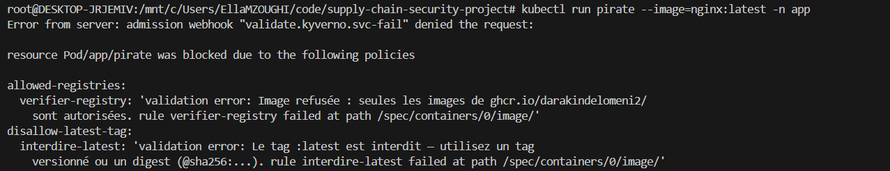

### 4.3 Image modifiée après signature

Un scénario de type “tampered image” a été simulé en reconstruisant une image modifiée puis en
la poussant sous le même tag. Le déploiement a été bloqué par Kyverno, comme illustré par la capture ci-dessous. Ce résultat
démontre que le contrôle porte sur le digest exact de l’image et non sur un tag mutable.

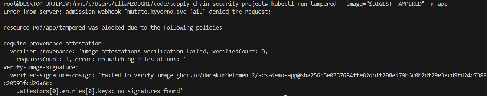

### 4.4 Registry non autorisé

Une image provenant d’un registre non autorisé a été refusée par les politiques de contrôle des
registries. La capture ci-dessous illustre ce blocage, qui empêche l’usage d’images provenant d’une source
non approuvée.

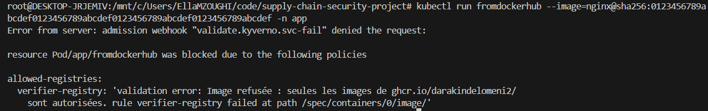

### 4.5 Tag `:latest`

Enfin, une image référencée avec le tag `:latest` a été rejetée. La capture ci-dessous confirme
que la politique de disallow-latest bloque les déploiements sur des tags mutables.

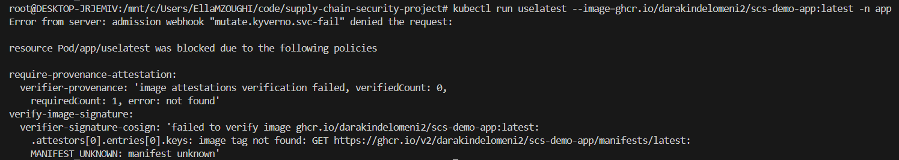 refusée" />

### 4.6 Synthèse des résultats

| Scénario                       | Résultat observé | Preuve                                                     |
| ------------------------------ | ---------------- | ---------------------------------------------------------- |
| Image légitime                 | ✅ acceptée      | [assets/lab4-cas-nominal.png](assets/lab4-cas-nominal.png) |
| Image non signée               | ❌ refusée       | [assets/lab4-non-signee.png](assets/lab4-non-signee.png)   |
| Image modifiée après signature | ❌ refusée       | [assets/lab4-tampered.png](assets/lab4-tampered.png)       |
| Registry non autorisé          | ❌ refusée       | [assets/lab4-registry.png](assets/lab4-registry.png)       |
| Tag`:latest`                   | ❌ refusée       | [assets/lab4-latest.png](assets/lab4-latest.png)           |

Ces résultats montrent que le cluster n’exécute que les images qu’il peut prouver comme signées, attestées et conformes à la politique d’admission. La chaîne de confiance n’est donc plus seulement théorique : elle se traduit par un refus effectif des artefacts non vérifiables.

## 5. Intégration CI/CD bout-en-bout

Le Lab 5 transfère la chaîne de confiance vers GitHub Actions : le passage du POC « fait à la main sur mon poste » à une chaîne réellement **SLSA L2**, avec un build hébergé et une identité de signature portée par l'OIDC du **workflow**, sans rien de manuel. Le workflow de référence
[../.github/workflows/supply-chain.yml](../.github/workflows/supply-chain.yml) enchaîne build,
SBOM, scan (gate Grype), push GHCR, signature **keyless** et attestations SBOM + provenance.

### 5.1 Pipeline CI : build, signature et attestations

Le workflow GitHub Actions a été exécuté avec succès de bout en bout : build de l'image, génération
du SBOM, scan Grype, push sur GHCR, signature **keyless** et attachement des attestations SBOM +
provenance, le tout sans intervention manuelle. La capture ci-dessous montre le résumé du run, avec le digest de l'image produite.

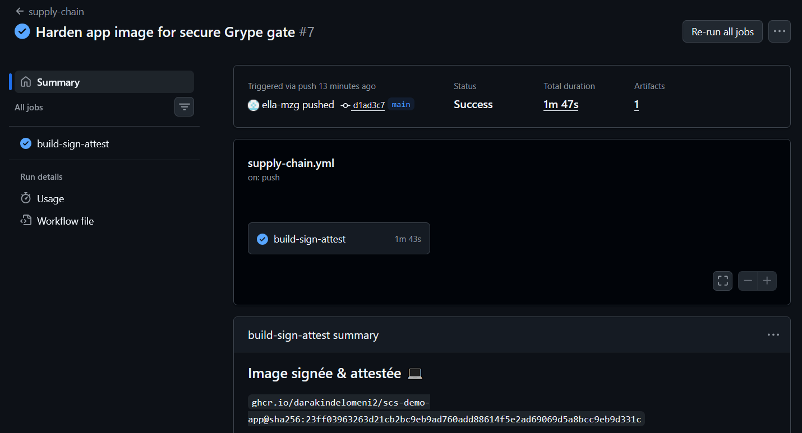

### 5.2 Vérification de l'identité keyless

`cosign verify` a été exécuté contre l'identité exacte du workflow (`https://github.com/<owner>/ supply-chain-security-project/.github/workflows/supply-chain.yml@refs/heads/main`, issuer OIDC
`token.actions.githubusercontent.com`). Les trois vérifications standard sont validées, et le
certificat retourné confirme l'identité réelle du workflow signataire, la preuve que la confiance
repose désormais sur une identité de plateforme, et non plus sur une clé locale.

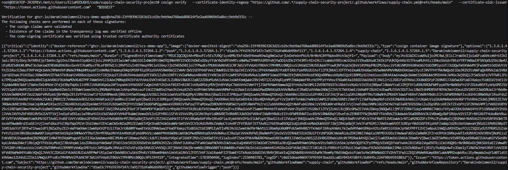

### 5.3 Politiques Kyverno adaptées au mode keyless

Les politiques `verify-image-signature` et `require-provenance-attestation` ont été basculées de la
vérification par clé publique vers la vérification par identité OIDC (bloc `keyless` en lieu et
place de `keys`). Une fois appliquées, les deux `ClusterPolicy` repassent à l'état `Ready`.

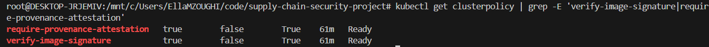

### 5.4 Admission de l'image CI-signée

Déployée sur le cluster, l'image produite par la CI est acceptée par Kyverno : signature keyless et
attestation de provenance sont toutes deux vérifiées à l'admission. Le pod démarre et passe à
l'état `Running`.

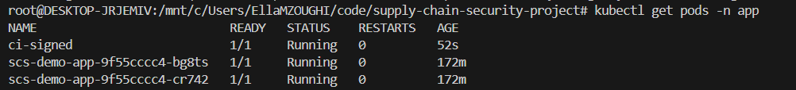

### 5.5 Attaque / défense : image non conforme à l'identité keyless

L'image déjà signée **par clé** au Lab 2 a été redéployée maintenant que les politiques sont
passées en mode keyless. N'ayant aucun certificat Fulcio/OIDC, ni sa signature ni son attestation
de provenance (également signée par clé) ne satisfont un vérificateur keyless : Kyverno refuse la
requête, `verify-image-signature` et `require-provenance-attestation` tous deux listés comme
bloquants. Preuve que la politique garde son rôle de coupe-circuit même en mode keyless.

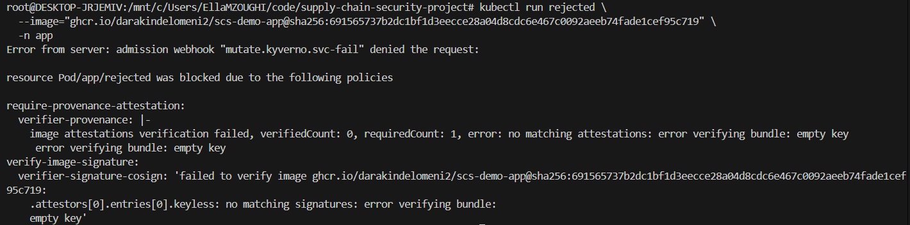

### 5.6 Synthèse des résultats

| Scénario                                                         | Résultat observé         | Preuve                                                                   |
| ---------------------------------------------------------------- | ------------------------ | ------------------------------------------------------------------------ |
| Pipeline CI complet (build → SBOM → scan → push → sign → attest) | ✅ Success               | [assets/lab5-build-sign-attest.png](assets/lab5-build-sign-attest.png)   |
| `cosign verify` en identité keyless                              | ✅ validé                | [assets/lab5-cosign-verify.png](assets/lab5-cosign-verify.png)           |
| Politiques Kyverno keyless actives                               | ✅`Ready`                | [assets/lab5-require-provenance.png](assets/lab5-require-provenance.png) |
| Image CI-signée déployée                                         | ✅ acceptée,`Running`    | [assets/lab5-signed-pod.png](assets/lab5-signed-pod.png)                 |
| Image non conforme à l'identité keyless                          | ❌ refusée à l'admission | [assets/lab5-admission-rejected.png](assets/lab5-admission-rejected.png) |

Ces résultats valident les 4 critères de sortie du lab : le workflow passe au vert, `cosign verify`
réussit avec l'identité du workflow, la politique Kyverno keyless accepte l'image CI et refuse le
reste.

### 5.7 Difficultés rencontrées

Trois obstacles ont dû être résolus pour boucler le Lab 5 :

1. **CVE CRITICAL héritée du projet de base : la gate Grype cassait systématiquement le workflow.**
   L'image fournie au départ (`python:3.12-slim` + `Flask==3.0.3` / `gunicorn==22.0.0`) contenait des
   CVE **CRITICAL corrigeables**, ce qui faisait échouer le job « Scan (Grype) — gate sur CRITICAL »
   avant même d'atteindre l'étape de signature (capture ci-dessous). Un premier réflexe, rendre le
   job **non bloquant** (`continue-on-error: true`) pour laisser la démo continuer, est l'anti-pattern
   exact que ce projet dénonce : on ne corrige pas une gate de sécurité en la désactivant. La
   résolution retenue a traité la cause : mise à jour de l'image de base
   (`python:3.12-slim` → `python:3.14-slim`), `apt-get upgrade` des paquets système, montée de version
   de Grype (`v0.80.0` → `v0.115.0`) et mise à jour des dépendances applicatives
   (`Flask 3.0.3→3.1.3`, `gunicorn 22.0.0→24.1.1`, `prometheus-client 0.20.0→0.22.0`), puis la gate
   `fail-on critical` a été restaurée en mode strict (bloquant).

   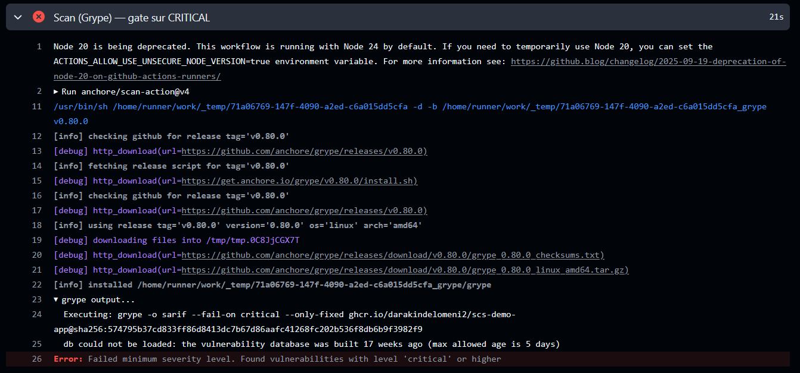

2. **`maxContextSize` Kyverno : un `ConfigMap`, pas un flag CLI.** L'attestation de provenance
   (2,4 Mo) a dépassé la même limite de contexte que le SBOM mais la limite n'est **pas**
   exposée en argument du conteneur `kyverno-admission-controller` : elle se configure via la clé
   `maxContextSize` du `ConfigMap kyverno` (namespace `kyverno`), absente par défaut.
3. **`imagePullSecrets` pour un pod ad-hoc.** `kubectl run` ne réutilise pas le `imagePullSecrets`
   du `Deployment` : sur un registre privé il faut l'ajouter explicitement, sans quoi Kyverno admet
   le pod (signature + provenance valides) mais le kubelet échoue ensuite en `401 Unauthorized` au
   pull, rappel que l'admission et le pull sont deux contrôles distincts.

### 5.8 Interprétation

Cette étape montre que la confiance n'est plus seulement portée par une clé locale ou un tag mutable,
mais par l'identité du workflow GitHub Actions lui-même. C'est l'élément central du passage vers un
niveau de maturité SLSA proche de L2 : le build est hébergé, la provenance est signée par l'OIDC du
runner, et le cluster n'accepte que les images produites par cette identité précise, à la casse
près : cela illustre concrètement que le « zero-trust » ne pardonne aucune approximation.

## 6. Positionnement SLSA & limites

**Deux voies, deux niveaux réellement atteints.** Sur la **voie locale** (Labs 1-4), la provenance
**existe** et est **signée**, mais elle est produite **sur notre poste** à partir d'un prédicat
rédigé à la main : elle _déclare_ l'origine sans prouver l'isolation du build, ce qui la limite à
**SLSA L1**. Sur la **voie CI** (Lab 5, §5), le build est **hébergé** sur GitHub Actions et la
provenance est signée par l'**identité OIDC du workflow** (Fulcio/Rekor), vérifiée à l'admission
par Kyverno : ce niveau, **SLSA L2**, est atteint et prouvé (§5.6). **L3** (build isolé,
provenance infalsifiable même par le job qui la génère) reste hors périmètre.

| Dimension      | Ce que nous avons (L2, voie CI)                                                   | Ce qu'il faudrait pour L3                                               |
| -------------- | --------------------------------------------------------------------------------- | ----------------------------------------------------------------------- |
| Build          | Hébergé (GitHub Actions), paramètres visibles dans le run                         | Build**isolé/éphémère**, non contournable par le job lui-même           |
| Provenance     | Signée par l'OIDC du runner, générée**dans le même job** que le build             | Générée par un**générateur isolé** (`slsa-github-generator` en mode L3) |
| Falsifiabilité | Un step malveillant dans le même job pourrait altérer le prédicat avant signature | Séparation stricte build/attestation, provenance**infalsifiable**       |

**Ce qui reste contournable (honnêteté) :**

- Sur la voie locale : on fait confiance au **poste de build** et à la personne qui signe, un
  initié légitime (cf. XZ) passe tous les contrôles cryptographiques.
- La provenance L1 (voie locale) est **auto-déclarée** : rien n'empêche d'y écrire un commit
  mensonger et de la signer quand même. La provenance L2 (voie CI) est liée à l'identité du
  workflow, mais reste écrite par le même job qu'elle atteste (cf. tableau ci-dessus) : un step
  compromis dans ce job pourrait la falsifier avant signature.
- La **clé privée cosign** (voie locale) est un secret local : sa fuite casse toute la chaîne. Le
  mode **keyless** de la CI (Lab 5) supprime ce risque en n'ayant aucune clé à protéger.
- Le registry public/privé ne protège que la **confidentialité**, pas l'intégrité.

**Limites techniques rencontrées et traitées (voie locale, Labs 1-4) :**

1. **cosign v3 ↔ Kyverno v1.18.** cosign v3 stocke signatures et attestations via l'**API OCI 1.1
   referrers** ; or la vérification d'attestation de cosign n'a pas de code path referrers
   (**bug upstream `sigstore/cosign#4708`**), limite héritée par Kyverno, qui rejetait les images à
   tort. Résolu en signant avec **cosign v2.4.1** (schéma _tag-based_). _Cause racine : le
   prérequis installe cosign via `latest`, un tag mutable **non épinglé**, l'anti-pattern même que
   ce projet dénonce. Leçon : on épingle les versions, y compris celles de la toolchain de
   sécurité._
2. **Limite de contexte Kyverno.** L'attestation SBOM SPDX niveau-fichier (2,3 Mo) dépassait le
   `maxContextSize` par défaut (2 Mi) → SBOM **package-level** (213 Ko) en solution immédiate. La
   même limite a resurgi en Lab 5 sur l'attestation de provenance CI ; elle **est** configurable en
   v1.18, via la clé `maxContextSize` du `ConfigMap kyverno` (pas un flag CLI, cf. §5.7).
3. **Registry privé.** Authentification à deux endroits (kubelet + Kyverno) via secrets dédiés,
   PAT `read:packages` en moindre privilège.
4. **Durcissement pod.** `runAsNonRoot` exige un **UID numérique** (`runAsUser: 10001`) car le
   Dockerfile utilise un `USER` nommé ; `readOnlyRootFilesystem` impose un volume `emptyDir` sur
   `/tmp` pour gunicorn.

**Pistes vers un niveau supérieur :** provenance générée par un **générateur isolé**
(`slsa-github-generator`, L3) plutôt que dans le job de build lui-même, identité de workflow
épinglée par version plutôt que par branche, et **attestation de scan** vérifiée à l'admission
(bloquer aussi sur vulnérabilité, pas seulement sur signature).

## 7. Reproductibilité

Reconstruction complète depuis un poste vierge. **Points d'attention critiques** signalés ⚠️.

**0. Outils & accès** — installer docker, kind, kubectl, syft, grype, jq (commandes par OS dans
[`docs/01-prerequis-setup.md`](../docs/01-prerequis-setup.md)). ⚠️ **Exception cosign** : épingler la
**v2.4.1** (la doc installe `latest` = v3, incompatible Kyverno — cf. §5) :

```bash
curl -sSfLo ~/.local/bin/cosign \
  https://github.com/sigstore/cosign/releases/download/v2.4.1/cosign-linux-amd64
chmod +x ~/.local/bin/cosign && cosign version | grep GitVersion   # attendu : v2.4.1
```

**Accès GHCR** — deux PAT (GitHub → _Settings → Developer settings → Tokens (classic)_) :
`write:packages` pour **pousser** l'image (`docker login ghcr.io`), et `read:packages`
(moindre privilège) pour le **secret du cluster** (`$GHCR_RO`, étape 5).

**1. Image** — `docker build ./app` → `docker push` → récupérer le **digest** (`$DIGEST`).

**2. SBOM + scan** — SBOM **package-level** (⚠️ léger, sous la limite Kyverno) puis scan :

```bash
syft "$IMG:$TAG" -o spdx-json | jq 'del(.files, .relationships)' > sbom.spdx.json
grype "$IMG:$TAG"        # gate .grype.yaml : casse sur CRITICAL corrigeable
```

**3. Signer + attester** (cosign v2, par digest) :

```bash
cosign sign   --key cosign.key "$DIGEST"
cosign attest --key cosign.key --predicate sbom.spdx.json  --type spdxjson       "$DIGEST"
cosign attest --key cosign.key --predicate provenance.json --type slsaprovenance "$DIGEST"
```

**4. Cluster + Kyverno** :

```bash
kind create cluster --name scs --config cluster/kind-config.yaml
kubectl create -f https://github.com/kyverno/kyverno/releases/latest/download/install.yaml
kubectl -n kyverno rollout status deploy/kyverno-admission-controller
kubectl create namespace app
```

**5. Secrets registry privé** (PAT `read:packages`) dans les **deux** namespaces :

```bash
kubectl create secret docker-registry ghcr-creds -n app \
  --docker-server=ghcr.io --docker-username=<user> --docker-password="$GHCR_RO"
kubectl create secret docker-registry ghcr-creds -n kyverno \
  --docker-server=ghcr.io --docker-username=<user> --docker-password="$GHCR_RO"
```

**6. Politiques** (avec `cosign.pub` + registry adaptés au fork) :

```bash
kubectl apply -f policies/kyverno/          # les 4 objets ClusterPolicy en Enforce
kubectl get clusterpolicy                   # les 4 → READY=true
```

**7. Déployer** (image par digest ; `deployment.yaml` inclut `runAsUser: 10001` et le volume
`emptyDir` sur `/tmp` — cf. §5) :

```bash
kubectl apply -n app -f k8s/deployment.yaml
kubectl get pods -n app                      # Running = image signée + provenance acceptées
```

**Nettoyage** : `kind delete cluster --name scs`.

## 8. Bilan

**Ce que nous avons appris.** Sécuriser la chaîne d'approvisionnement, ce n'est pas ajouter un
scan de plus : c'est **déplacer la confiance** vers une identité de build et la **vérifier à
l'admission**. Trois distinctions structurantes se sont imposées en pratique : _origine_ (signature)
≠ _sûreté_ (scan) ; _détecter_ (Grype, au build) ≠ _empêcher_ (Kyverno, au runtime) ; _tag_ mutable
≠ _digest_ immuable. Le passage `Audit → Enforce` matérialise le « on ne fait pas confiance, on
vérifie ».

**Ce que nous referions autrement.** La leçon la plus marquante est venue d'un échec : la toolchain
elle-même doit être **épinglée**. Installer cosign via `latest` (= v3, stockage OCI 1.1 referrers)
a rendu les images non vérifiables par Kyverno pendant des heures — l'anti-pattern exact que le
projet dénonce. On épinglerait **cosign v2** et on générerait un **SBOM package-level** dès le
départ, et on testerait l'admission **tôt** (au lieu de tout signer avant de découvrir l'incompat).

**Répartition du travail.**

- **Valéry-Alexandre CAMUS** — Labs 0→3 (build, SBOM/scan, signature/attestations, cluster +
  Kyverno + admission), résolution des incompatibilités de version, rapport §1-6.
- **Ella MZOUGHI** — Labs 4→5 (démo attaque/défense, intégration CI GitHub Actions en keyless),
  résolution des blocages CI (CVE de l'image de base, identité OIDC, `maxContextSize` Kyverno),
  rapport §4-6.

## Annexes

### A. Preuves de transparence — Rekor

Même signée **par clé**, chaque opération cosign v2 est inscrite dans le journal de transparence
public **Rekor** (index `tlog`), consultables par tous :

| Artefact               | Index Rekor  | Lien                                                                                                 |
| ---------------------- | ------------ | ---------------------------------------------------------------------------------------------------- |
| Signature image        | `2118027833` | [https://search.sigstore.dev/?logIndex=2118027833](https://search.sigstore.dev/?logIndex=2118027833) |
| Attestation SBOM       | `2118030651` | [https://search.sigstore.dev/?logIndex=2118030651](https://search.sigstore.dev/?logIndex=2118030651) |
| Attestation provenance | `2118032937` | [https://search.sigstore.dev/?logIndex=2118032937](https://search.sigstore.dev/?logIndex=2118032937) |

### B. Vérifications cosign (sorties brutes)

```bash
cosign verify --key cosign.pub "$DIGEST"

Verification for ghcr.io/darakindelomeni2/scs-demo-app@sha256:691565737b2dc1bf1d3eecce28a04d8cdc6e467c0092aeeb74fade1cef95c719 --
The following checks were performed on each of these signatures:
  - The cosign claims were validated
  - Existence of the claims in the transparency log was verified offline
  - The signatures were verified against the specified public key

[{"critical":{"identity":{"docker-reference":"ghcr.io/darakindelomeni2/scs-demo-app"},"image":{"docker-manifest-digest":"sha256:691565737b2dc1bf1d3eecce28a04d8cdc6e467c0092aeeb74fade1cef95c719"},"type":"cosign container image signature"},"optional":{"Bundle":{"SignedEntryTimestamp":"MEUCIEhTztz0MMBI8LLCQBUWZ1fyfPrHIFyjMQgJLn5cH4mUAiEArOtZUIvbhjwsN1ByY6pSJPHfQK2o5GhT0Q9r2r7iMLE=","Payload":{"body":"eyJhcGlWZXJzaW9uIjoiMC4wLjEiLCJraW5kIjoiaGFzaGVkcmVrb3JkIiwic3BlYyI6eyJkYXRhIjp7Imhhc2giOnsiYWxnb3JpdGhtIjoic2hhMjU2IiwidmFsdWUiOiI3YzlkNDhlMjkzODQ1ZWViNTFmMjI4NzE0NDYyYWI1M2RkNTk3OGI1ZDNjZTcyODNmY2U3ZjQ0MmZiYzc3MjQ1In19LCJzaWduYXR1cmUiOnsiY29udGVudCI6Ik1FVUNJRXg2L1Z5T1R5L2NmOERadmN2cW1QYjdvNGJTV0dQN1JXTHNtMUlseitSeUFpRUF5WkpvQ1hpYTdaM3NBeDZuMTlTRnZyQzk1RWtJZUUxZitWcVF0YUcxM21RPSIsInB1YmxpY0tleSI6eyJjb250ZW50IjoiTFMwdExTMUNSVWRKVGlCUVZVSk1TVU1nUzBWWkxTMHRMUzBLVFVacmQwVjNXVWhMYjFwSmVtb3dRMEZSV1VsTGIxcEplbW93UkVGUlkwUlJaMEZGYVRSdWMwSTFWMG96ZDJrMlNYRTNOWEF4UmxWTlFrNHhTVFJXYXdwMlMzbzFaRmR5VnpScVMxcEVUVUlyUlVoelVuSldSRlZtUkRKbE5IQkNiRnBZTkROTVNFVlpaa05XTVU5V2RYQnJlRVU0ZUN0TFoxaEJQVDBLTFMwdExTMUZUa1FnVUZWQ1RFbERJRXRGV1MwdExTMHRDZz09In19fX0=","integratedTime":1783529101,"logIndex":2118027833,"logID":"c0d23d6ad406973f9559f3ba2d1ca01f84147d8ffc5b8445c224f98b9591801d"}}}}]
```

```bash
cosign verify-attestation --key cosign.pub --type spdxjson       "$DIGEST" | jq -r .payload | base64 -d | jq .predicateType

Verification for ghcr.io/darakindelomeni2/scs-demo-app@sha256:691565737b2dc1bf1d3eecce28a04d8cdc6e467c0092aeeb74fade1cef95c719 --
The following checks were performed on each of these signatures:
  - The cosign claims were validated
  - Existence of the claims in the transparency log was verified offline
  - The signatures were verified against the specified public key
"https://spdx.dev/Document"
```

```bash
cosign verify-attestation --key cosign.pub --type slsaprovenance "$DIGEST" | jq -r .payload | base64 -d | jq .predicateType

Verification for ghcr.io/darakindelomeni2/scs-demo-app@sha256:691565737b2dc1bf1d3eecce28a04d8cdc6e467c0092aeeb74fade1cef95c719 --
The following checks were performed on each of these signatures:
  - The cosign claims were validated
  - Existence of the claims in the transparency log was verified offline
  - The signatures were verified against the specified public key
"https://slsa.dev/provenance/v0.2"
```

```bash
cosign tree "$DIGEST"
📦 Supply Chain Security Related artifacts for an image: ghcr.io/darakindelomeni2/scs-demo-app@sha256:691565737b2dc1bf1d3eecce28a04d8cdc6e467c0092aeeb74fade1cef95c719
└── 💾 Attestations for an image tag: ghcr.io/darakindelomeni2/scs-demo-app:sha256-691565737b2dc1bf1d3eecce28a04d8cdc6e467c0092aeeb74fade1cef95c719.att
   ├── 🍒 sha256:fcc4b58daf0ddb7bfe395425270d11575ec7d2f1f553e15f822643871e1eff48
   └── 🍒 sha256:5d9f1b1f4248cc801090f5e5cc2baa1628561686f1690cae9ab3c4dc10219785
└── 🔐 Signatures for an image tag: ghcr.io/darakindelomeni2/scs-demo-app:sha256-691565737b2dc1bf1d3eecce28a04d8cdc6e467c0092aeeb74fade1cef95c719.sig
   └── 🍒 sha256:7c9d48e293845eeb51f228714462ab53dd5978b5d3ce7283fce7f442fbc77245
```

### C. Admission Kyverno (sorties brutes)

Refus d'une image signée par clé (Lab 2) contre les politiques passées en mode keyless (Lab 5),
cf. §5.5 :

```text
kubectl run rejected --image="ghcr.io/darakindelomeni2/scs-demo-app@sha256:691565737b2dc1bf1d3eecce28a04d8cdc6e467c0092aeeb74fade1cef95c719" -n app

Error from server: admission webhook "mutate.kyverno.svc-fail" denied the request:

resource Pod/app/rejected was blocked due to the following policies

require-provenance-attestation:
  verifier-provenance: |-
    image attestations verification failed, verifiedCount: 0, requiredCount: 1, error: no matching attestations: error verifying bundle: empty key
     error verifying bundle: empty key
verify-image-signature:
  verifier-signature-cosign: 'failed to verify image ghcr.io/darakindelomeni2/scs-demo-app@sha256:691565737b2dc1bf1d3eecce28a04d8cdc6e467c0092aeeb74fade1cef95c719:
    .attestors[0].entries[0].keyless: no matching signatures: error verifying bundle:
    empty key'
```

```bash
kubectl get clusterpolicy
NAME                             ADMISSION   BACKGROUND   READY   AGE    MESSAGE
allowed-registries               true        true         True    135m   Ready
disallow-latest-tag              true        true         True    135m   Ready
require-provenance-attestation   true        false        True    135m   Ready
verify-image-signature           true        false        True    135m   Ready
```

```bash
kubectl get pods -n app
NAME                           READY   STATUS    RESTARTS   AGE
scs-demo-app-9f55cccc4-9r8vq   1/1     Running   0          42m
scs-demo-app-9f55cccc4-sxfld   1/1     Running   0          42m
```

### D. Commandes complètes

> Séquence reproductible complète : voir §6. Fichiers clés : `policies/kyverno/`, `k8s/deployment.yaml`,
> `.grype.yaml`, `cosign.pub`.
